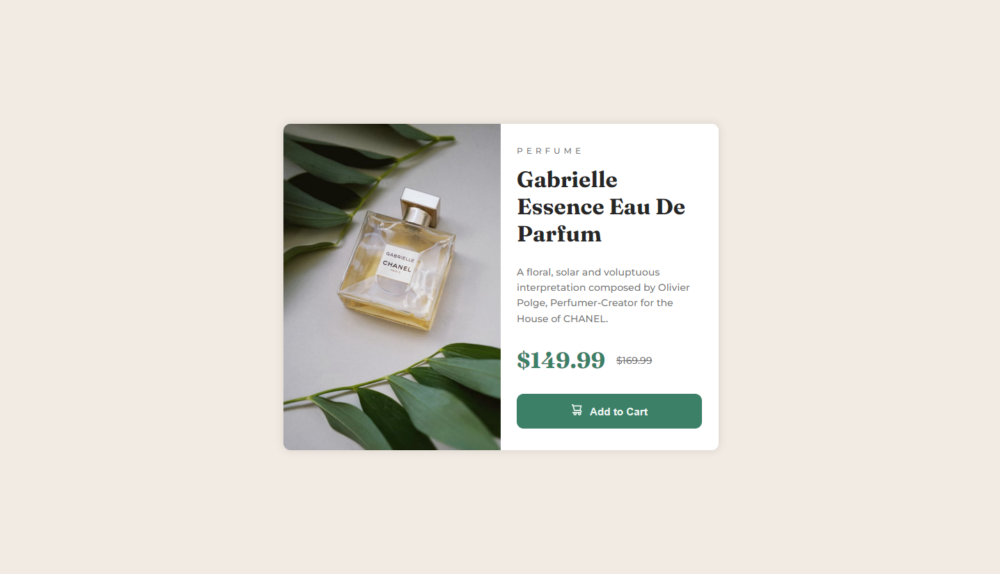
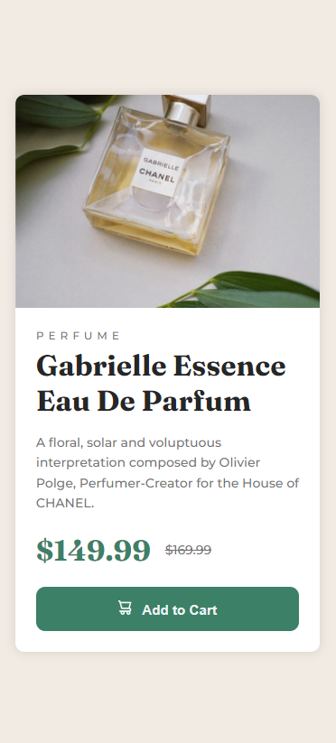

# Frontend Mentor - Product preview card component solution

This is a solution to the [Product preview card component challenge on Frontend Mentor](https://www.frontendmentor.io/challenges/product-preview-card-component-GO7UmttRfa). Frontend Mentor challenges help you improve your coding skills by building realistic projects. 

## Table of contents

- [Overview](#overview)
  - [The challenge](#the-challenge)
  - [Screenshot](#screenshot)
  - [Links](#links)
- [My process](#my-process)
  - [Built with](#built-with)
  - [What I learned](#what-i-learned)
  - [Continued development](#continued-development)
  - [Useful resources](#useful-resources)
- [Author](#author)

## Overview

### The challenge

Users should be able to:

- View the optimal layout depending on their device's screen size
- See hover and focus states for interactive elements

### Screenshot

### Links

- Solution URL: [Add solution URL here](https://your-solution-url.com)
- Live Site URL: [Add live site URL here](https://your-live-site-url.com)

## My process

### Built with

- Flexbox

### What I learned

I was unsure how to change images based on device size, but found some helpful resources online.
I am using these excercises as a way to practise what I gave learnt through my course.

### Continued development

I still have a ton to learn, so it is hard to actually know where I should focus. 

### Useful resources

- [write corbpie](https://write.corbpie.com/change-image-based-on-screen-size/) - This helped figure out the images issue I did not know.

## Author

- Website - [Working on it]()
- Frontend Mentor - [@Laura-BugFree](https://www.frontendmentor.io/profile/Laura-Bugfree)

